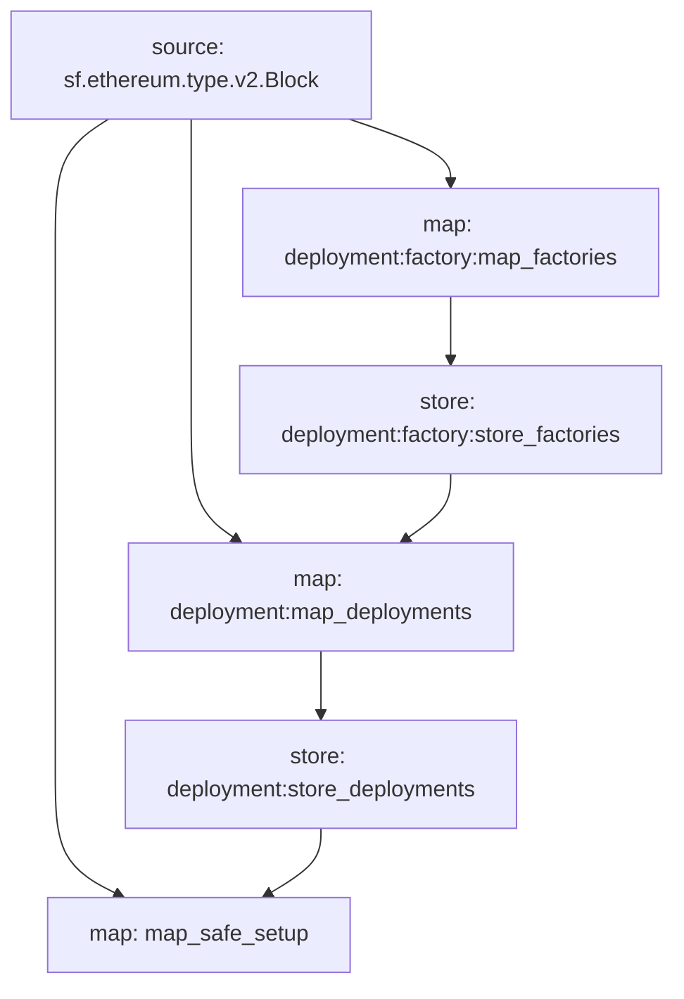

```mermaid
graph TD;
  map_safe_setup[map: map_safe_setup]
  sf.ethereum.type.v2.Block[source: sf.ethereum.type.v2.Block] --> map_safe_setup
  deployment:store_deployments --> map_safe_setup
  deployment:map_deployments[map: deployment:map_deployments]
  sf.ethereum.type.v2.Block[source: sf.ethereum.type.v2.Block] --> deployment:map_deployments
  deployment:factory:store_factories --> deployment:map_deployments
  deployment:store_deployments[store: deployment:store_deployments]
  deployment:map_deployments --> deployment:store_deployments
  deployment:factory:map_factories[map: deployment:factory:map_factories]
  sf.ethereum.type.v2.Block[source: sf.ethereum.type.v2.Block] --> deployment:factory:map_factories
  deployment:factory:store_factories[store: deployment:factory:store_factories]
  deployment:factory:map_factories --> deployment:factory:store_factories
```